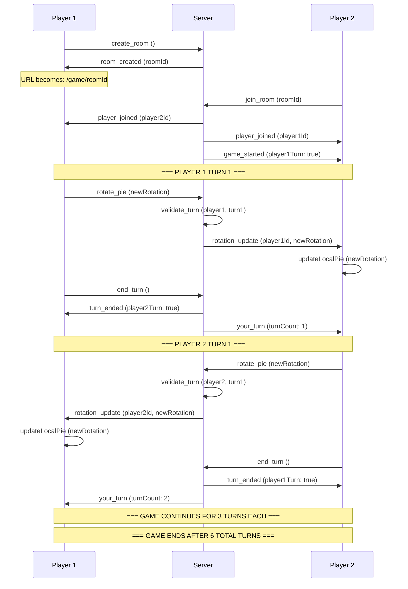

# Multiplayer Spinning Pie Game - Architectural Documentation

## Current Project Analysis
- React TypeScript application using Create React App
- Single-player spinning pie chart with 7 cricket score slices (0, 1, 2, 4, 6, W, NB)
- Interactive rotation and click detection already implemented

## Technology Stack Requirements

### Frontend (Enhanced)
```typescript
// Additional dependencies needed:
"socket.io-client": "^4.7.2"           // Real-time communication
"@types/socket.io-client": "^3.0.0"   // TypeScript types
"uuid": "^9.0.0"                      // Generate unique room IDs
"react-router-dom": "^6.8.0"          // URL-based routing for rooms
"@types/react-router-dom": "^5.3.0"   // TypeScript types for routing
```

### Backend (New) - TypeScript
```json
{
  "socket.io": "^4.7.2",                    // Real-time server
  "express": "^4.18.0",                     // HTTP server
  "cors": "^2.8.5",                         // Cross-origin requests
  "uuid": "^9.0.0",                         // Room ID generation
  "typescript": "^5.0.0",                   // TypeScript compiler
  "@types/express": "^4.17.0",              // Express TypeScript types
  "@types/cors": "^2.8.0",                  // CORS TypeScript types
  "@types/uuid": "^9.0.0",                  // UUID TypeScript types
  "@types/node": "^20.0.0",                 // Node.js TypeScript types
  "ts-node-dev": "^2.0.0",                  // Development TypeScript runner
  "nodemon": "^2.0.0"                       // Auto-restart during development
}
```

### TypeScript Configuration
```json
// tsconfig.json
{
  "compilerOptions": {
    "target": "ES2020",
    "module": "commonjs",
    "lib": ["ES2020"],
    "outDir": "./dist",
    "rootDir": "./src",
    "strict": true,
    "esModuleInterop": true,
    "skipLibCheck": true,
    "forceConsistentCasingInFileNames": true,
    "resolveJsonModule": true
  },
  "include": ["src/**/*"],
  "exclude": ["node_modules", "dist"]
}
```

## Backend Server Architecture

### Server Requirements: YES, Essential

**Why a backend server is necessary:**
1. **Room Management** - Track which players are in which rooms
2. **Game State Synchronization** - Coordinate real-time updates between players
3. **Player Connection Management** - Handle player joins, leaves, disconnections
4. **State Validation** - Ensure game integrity and prevent cheating

### Server Structure
```
backend/
├── src/
│   ├── server.ts              # Main server file (TypeScript)
│   ├── gameState.ts          # Game state management (TypeScript)
│   ├── roomManager.ts        # Room creation and player management (TypeScript)
│   └── types/
│       └── index.ts          # TypeScript type definitions
├── dist/                     # Compiled JavaScript (auto-generated)
├── package.json
├── tsconfig.json             # TypeScript configuration
└── nodemon.json             # Auto-restart configuration
```

**TypeScript Type Definitions - Turn-Based Game:**
```typescript
// src/types/index.ts
export interface Player {
  id: string;
  roomId: string;
  connected: boolean;
  isRoomCreator: boolean; // Determines who goes first
}

export interface GameRoom {
  id: string;
  players: Player[];
  maxPlayers: number;
  created: Date;
  isActive: boolean; // Game in progress
}

export interface TurnState {
  currentPlayerId: string;
  turnNumber: number; // 1-6 (3 turns each)
  totalTurns: number; // 6 for this game
  isPlayer1Turn: boolean;
  gamePhase: 'waiting' | 'playing' | 'finished';
}

export interface GameState {
  playerId: string;
  roomId: string;
  rotation: number;
  turnState: TurnState;
  timestamp: Date;
  moveHistory: TurnRecord[];
}

export interface TurnRecord {
  turnNumber: number;
  playerId: string;
  rotation: number;
  timestamp: Date;
}

export interface ServerEvents {
  create_room: () => void;
  join_room: (roomId: string) => void;
  rotate_pie: (data: { roomId: string; playerId: string; rotation: number }) => void;
  end_turn: () => void;
}

export interface ClientEvents {
  room_created: (roomId: string) => void;
  player_joined: (player: Player) => void;
  game_started: (data: { isPlayer1Turn: boolean; turnNumber: number }) => void;
  player_left: (playerId: string) => void;
  rotation_update: (data: { playerId: string; rotation: number; turnNumber: number }) => void;
  turn_ended: (data: { nextPlayerTurn: boolean; turnNumber: number }) => void;
  your_turn: (data: { turnNumber: number; remainingTurns: number }) => void;
  game_ended: (data: { winner?: string; finalScore: TurnRecord[] }) => void;
  invalid_move: (reason: string) => void;
  room_full: () => void;
  room_not_found: () => void;
}
```

**Key Server Components:**

1. **Room Manager** (`roomManager.ts`)
   - Generate unique room IDs using UUID
   - Track players in each room (max 2 players) with type safety
   - Handle player joining/leaving with validation
   - Room cleanup on disconnect with proper typing

2. **Game State Manager** (`gameState.ts`)
   - Store current rotation for each player with `GameState` interface
   - Validate rotation updates with type checking
   - Broadcast state changes to room participants with proper event typing

## Real-Time Synchronization Architecture

### Turn-Based Game Flow - URL-Based Room Joining


### Socket Events - Turn-Based Game
- `create_room` - Create a new game room and get room ID
- `room_created` - Server confirms room creation with room ID
- `join_room` - Player joins a specific room using room ID from URL
- `player_joined` - Notify other player of new participant
- `game_started` - Server signals game beginning (room creator goes first)
- `rotate_pie` - Send rotation updates (only allowed on player's turn)
- `rotation_update` - Receive rotation from other player
- `end_turn` - Player signals they want to end their turn
- `turn_ended` - Server confirms turn end and switches active player
- `your_turn` - Server notifies player it's their turn
- `game_ended` - Server signals game completion after 6 turns
- `player_left` - Handle player disconnection
- `game_reset` - Reset game state for new game

### Turn-Based Game Flow
1. **Room Creation**: Player 1 creates room, gets URL with room ID
2. **Game Start**: Player 2 joins via URL, game begins automatically
3. **Turn Order**: Room creator (Player 1) always takes first turn
4. **Turn Structure**: Rotate pie → Send to opponent → Click "End Turn"
5. **Turn Validation**: Server enforces turn order and prevents out-of-turn moves
6. **Game End**: After 3 turns each (6 total), game ends automatically

### Synchronization Strategy
1. **Immediate Broadcasting** - Rotation changes broadcast instantly
2. **State Validation** - Server validates rotation values
3. **Conflict Resolution** - Last update wins (simple strategy for 2-player)
4. **Connection Recovery** - Re-sync state on reconnection

## Frontend Architecture Changes

### Frontend URL-Based Room Management
```typescript
// src/hooks/useRoom.ts - Custom hook for room management
import { useEffect, useState } from 'react';
import { useNavigate, useParams } from 'react-router-dom';

export const useRoom = (socket: Socket<ClientEvents, ServerEvents> | null) => {
  const navigate = useNavigate();
  const { roomId } = useParams<{ roomId: string }>();
  const [currentRoomId, setCurrentRoomId] = useState<string | null>(roomId || null);
  const [isCreatingRoom, setIsCreatingRoom] = useState(false);

  const createRoom = useCallback(async () => {
    if (!socket || isCreatingRoom) return;

    setIsCreatingRoom(true);
    socket.emit('create_room');

    socket.once('room_created', (newRoomId: string) => {
      setCurrentRoomId(newRoomId);
      navigate(`/game/${newRoomId}`);
      setIsCreatingRoom(false);
    });
  }, [socket, navigate, isCreatingRoom]);

  const joinRoom = useCallback((targetRoomId: string) => {
    if (!socket) return;

    socket.emit('join_room', targetRoomId);
    setCurrentRoomId(targetRoomId);
    navigate(`/game/${targetRoomId}`);
  }, [socket, navigate]);

  return {
    currentRoomId,
    createRoom,
    joinRoom,
    isCreatingRoom
  };
};
```

### Enhanced Turn-Based SpinPie Component
```typescript
import { Socket } from 'socket.io-client';
import { useRoom } from '../hooks/useRoom';

// TypeScript interfaces for turn-based multiplayer
interface SpinPieProps {
  playerId: string;
  roomId: string | null;
  isMultiplayer: boolean;
  socket: Socket<ClientEvents, ServerEvents> | null;
  isRoomCreator: boolean; // Determines turn order
}

interface GameState {
  isMyTurn: boolean;
  currentTurn: number;
  totalTurns: number;
  gamePhase: 'waiting' | 'playing' | 'finished';
  myRotation: number;
  opponentRotation: number;
  turnHistory: TurnRecord[];
}

const SpinPie: React.FC<SpinPieProps> = ({
  playerId,
  roomId,
  isMultiplayer,
  socket,
  isRoomCreator
}) => {
  const [gameState, setGameState] = useState<GameState>({
    isMyTurn: isRoomCreator, // Room creator goes first
    currentTurn: 1,
    totalTurns: 6,
    gamePhase: 'waiting',
    myRotation: 0,
    opponentRotation: 0,
    turnHistory: []
  });

  // TypeScript event handler functions for turn-based gameplay
  const handleGameStarted = useCallback((data: { isPlayer1Turn: boolean; turnNumber: number }) => {
    setGameState(prev => ({
      ...prev,
      isMyTurn: data.isPlayer1Turn === isRoomCreator,
      currentTurn: data.turnNumber,
      gamePhase: 'playing'
    }));
  }, [isRoomCreator]);

  const handleRotationUpdate = useCallback((data: { playerId: string; rotation: number; turnNumber: number }) => {
    if (data.playerId !== playerId) {
      setGameState(prev => ({
        ...prev,
        opponentRotation: data.rotation,
        currentTurn: data.turnNumber
      }));
    }
  }, [playerId]);

  const handleTurnEnded = useCallback((data: { nextPlayerTurn: boolean; turnNumber: number }) => {
    setGameState(prev => ({
      ...prev,
      isMyTurn: data.nextPlayerTurn === isRoomCreator,
      currentTurn: data.turnNumber
    }));
  }, [isRoomCreator]);

  const handleYourTurn = useCallback((data: { turnNumber: number; remainingTurns: number }) => {
    setGameState(prev => ({
      ...prev,
      isMyTurn: true,
      currentTurn: data.turnNumber,
      totalTurns: data.remainingTurns + data.turnNumber - 1
    }));
  }, []);

  const handleGameEnded = useCallback((data: { winner?: string; finalScore: TurnRecord[] }) => {
    setGameState(prev => ({
      ...prev,
      gamePhase: 'finished',
      turnHistory: data.finalScore
    }));
  }, []);

  // Socket event listeners for turn-based events
  useEffect(() => {
    if (!socket || !isMultiplayer || !roomId) return;

    socket.on('game_started', handleGameStarted);
    socket.on('rotation_update', handleRotationUpdate);
    socket.on('turn_ended', handleTurnEnded);
    socket.on('your_turn', handleYourTurn);
    socket.on('game_ended', handleGameEnded);

    return () => {
      socket.off('game_started', handleGameStarted);
      socket.off('rotation_update', handleRotationUpdate);
      socket.off('turn_ended', handleTurnEnded);
      socket.off('your_turn', handleYourTurn);
      socket.off('game_ended', handleGameEnded);
    };
  }, [socket, isMultiplayer, roomId, handleGameStarted, handleRotationUpdate, handleTurnEnded, handleYourTurn, handleGameEnded]);

  // Emit rotation changes (only allowed during player's turn)
  const emitRotationChange = useCallback((newRotation: number) => {
    if (socket && isMultiplayer && roomId && gameState.isMyTurn) {
      socket.emit('rotate_pie', { roomId, playerId, rotation: newRotation });
    }
  }, [socket, isMultiplayer, roomId, playerId, gameState.isMyTurn]);

  // End current player's turn
  const endTurn = useCallback(() => {
    if (socket && gameState.isMyTurn) {
      socket.emit('end_turn');
    }
  }, [socket, gameState.isMyTurn]);

  return (
    <div>
      {/* Turn indicator */}
      <div className="turn-indicator">
        {gameState.gamePhase === 'finished' ? (
          <h2>Game Finished!</h2>
        ) : gameState.isMyTurn ? (
          <h2>Your Turn (Turn {gameState.currentTurn}/6)</h2>
        ) : (
          <h2>Opponent's Turn (Turn {gameState.currentTurn}/6)</h2>
        )}
      </div>

      {/* Main game component */}
      <SpinPieCanvas
        rotation={gameState.isMyTurn ? gameState.myRotation : gameState.opponentRotation}
        onRotationChange={emitRotationChange}
        disabled={!gameState.isMyTurn || gameState.gamePhase !== 'playing'}
      />

      {/* End turn button */}
      {gameState.isMyTurn && gameState.gamePhase === 'playing' && (
        <button onClick={endTurn} className="end-turn-btn">
          End Turn ({gameState.currentTurn}/6)
        </button>
      )}

      {/* Game history */}
      {gameState.gamePhase === 'finished' && (
        <div className="game-history">
          <h3>Game Complete!</h3>
          <div>Final Score: {gameState.turnHistory.length} moves played</div>
        </div>
      )}
    </div>
  );
};
```

### Backend TypeScript Implementation - Turn-Based Game
```typescript
// src/server.ts
import express from 'express';
import { createServer } from 'http';
import { Server as SocketIOServer } from 'socket.io';
import cors from 'cors';
import { v4 as uuidv4 } from 'uuid';
import { RoomManager } from './roomManager';
import { GameStateManager } from './gameState';

const app = express();
const server = createServer(app);

// Enable CORS for frontend-backend communication
app.use(cors({
  origin: process.env.FRONTEND_URL || "http://localhost:3000",
  credentials: true
}));

const io = new SocketIOServer<ClientEvents, ServerEvents>(server, {
  cors: {
    origin: process.env.FRONTEND_URL || "http://localhost:3000",
    methods: ["GET", "POST"]
  }
});

const roomManager = new RoomManager();
const gameStateManager = new GameStateManager();

io.on('connection', (socket: Socket<ClientEvents, ServerEvents>) => {
  console.log(`Client connected: ${socket.id}`);

  // Handle room creation
  socket.on('create_room', () => {
    try {
      const roomId = uuidv4();
      const player = roomManager.createRoom(socket.id, roomId);
      socket.join(roomId);

      socket.emit('room_created', roomId);
      console.log(`Room created: ${roomId} by player: ${socket.id}`);
    } catch (error) {
      console.error('Error creating room:', error);
      socket.emit('room_not_found');
    }
  });

  // Handle room joining via URL
  socket.on('join_room', (roomId: string) => {
    try {
      const room = roomManager.getRoom(roomId);
      if (!room) {
        socket.emit('room_not_found');
        return;
      }

      if (room.players.length >= 2) {
        socket.emit('room_full');
        return;
      }

      const player = roomManager.addPlayerToRoom(socket.id, roomId);
      socket.join(roomId);

      // Notify all players in the room
      io.to(roomId).emit('player_joined', player);

      // Check if both players are now connected
      const updatedRoom = roomManager.getRoom(roomId);
      if (updatedRoom && updatedRoom.players.length === 2) {
        // Start the game - room creator goes first
        const roomCreatorId = updatedRoom.players.find(p => p.isRoomCreator)?.id;
        if (roomCreatorId) {
          gameStateManager.startGame(roomId, roomCreatorId);
          io.to(roomId).emit('game_started', {
            isPlayer1Turn: true,
            turnNumber: 1
          });
          console.log(`Game started in room: ${roomId}`);
        }
      }

      console.log(`Player ${socket.id} joined room: ${roomId}`);
    } catch (error) {
      console.error('Error joining room:', error);
      socket.emit('room_not_found');
    }
  });

  // Handle pie rotation (turn-based)
  socket.on('rotate_pie', (data: { roomId: string; playerId: string; rotation: number }) => {
    try {
      // Validate it's the player's turn
      const isValidTurn = gameStateManager.validateTurn(data.playerId, data.roomId);

      if (!isValidTurn) {
        socket.emit('invalid_move', 'Not your turn or game not active');
        return;
      }

      // Record the move and update game state
      const turnRecord = gameStateManager.recordMove(data.playerId, data.roomId, data.rotation);

      // Broadcast rotation to opponent
      socket.to(data.roomId).emit('rotation_update', {
        playerId: data.playerId,
        rotation: data.rotation,
        turnNumber: turnRecord.turnNumber
      });

      console.log(`Player ${data.playerId} rotated in room ${data.roomId}: ${data.rotation}`);
    } catch (error) {
      console.error('Error updating rotation:', error);
      socket.emit('invalid_move', 'Failed to process rotation');
    }
  });

  // Handle end turn
  socket.on('end_turn', () => {
    try {
      // Get current game state for this player
      const currentPlayer = roomManager.getPlayerBySocketId(socket.id);
      if (!currentPlayer) return;

      const nextTurn = gameStateManager.endTurn(currentPlayer.roomId);

      if (nextTurn.isGameEnded) {
        // Game is over
        io.to(currentPlayer.roomId).emit('game_ended', {
          finalScore: nextTurn.moveHistory
        });
      } else {
        // Next player's turn
        io.to(currentPlayer.roomId).emit('turn_ended', {
          nextPlayerTurn: nextTurn.isPlayer1Turn,
          turnNumber: nextTurn.turnNumber
        });

        // Notify the player whose turn it is
        const nextPlayerSocketId = roomManager.getPlayerSocketId(nextTurn.currentPlayerId);
        if (nextPlayerSocketId) {
          io.to(nextPlayerSocketId).emit('your_turn', {
            turnNumber: nextTurn.turnNumber,
            remainingTurns: nextTurn.remainingTurns
          });
        }
      }
    } catch (error) {
      console.error('Error ending turn:', error);
    }
  });

  socket.on('disconnect', () => {
    roomManager.removePlayerFromRoom(socket.id);
    console.log(`Client disconnected: ${socket.id}`);
  });
});

// Serve the frontend build in production (optional)
if (process.env.NODE_ENV === 'production') {
  app.use(express.static('../frontend/build'));
}

const PORT = process.env.PORT || 3001;
server.listen(PORT, () => {
  console.log(`Turn-based TypeScript server running on port ${PORT}`);
});
```

### Frontend Routing Structure
```typescript
// src/App.tsx - Add React Router for URL-based room joining
import { BrowserRouter as Router, Routes, Route } from 'react-router-dom';
import SpinPie from './Spin';
import RoomLobby from './RoomLobby';

function App() {
  return (
    <Router>
      <div className="App">
        <Routes>
          <Route path="/" element={<RoomLobby />} />
          <Route path="/game/:roomId" element={<SpinPie />} />
        </Routes>
      </div>
    </Router>
  );
}

// src/RoomLobby.tsx - Component for room creation and URL input
import { useRoom } from './hooks/useRoom';

const RoomLobby: React.FC = () => {
  const { createRoom, joinRoom, isCreatingRoom } = useRoom(socket);
  const [inputRoomId, setInputRoomId] = useState('');

  return (
    <div>
      <button onClick={createRoom} disabled={isCreatingRoom}>
        {isCreatingRoom ? 'Creating Game...' : 'Create New Game'}
      </button>

      <div>
        <input
          type="text"
          placeholder="Enter Room ID"
          value={inputRoomId}
          onChange={(e) => setInputRoomId(e.target.value)}
        />
        <button onClick={() => joinRoom(inputRoomId)}>
          Join Room
        </button>
      </div>
    </div>
  );
};
```

## Deployment Considerations

### Development Setup
- Frontend: `npm start` (port 3000)
- Backend: `npm run dev` (port 3001) - Uses ts-node-dev for TypeScript hot reload
- Socket.IO CORS configuration for local development
- TypeScript compilation watches for changes automatically
- Room URLs: `http://localhost:3000/game/{roomId}` for testing

### URL Structure
```
/              - Room lobby (create or join rooms)
/game/{roomId} - Active game room with spinning pie
```

### Backend Development Scripts
```json
// package.json scripts
{
  "scripts": {
    "dev": "ts-node-dev --respawn --transpile-only src/server.ts",
    "build": "tsc",
    "start": "node dist/server.js",
    "prod": "npm run build && npm start"
  }
}
```

### Production Deployment
- **Build Process**: TypeScript compilation to JavaScript (`dist/` folder)
- **Environment Variables**: Server URLs, port configuration, CORS origins
- **Process Management**: PM2 or similar for production TypeScript servers
- **Single Server**: Frontend and backend on same server with proxy
- **Separate Servers**: Frontend (port 3000) + Backend (port 3001) with CORS

### TypeScript-Specific Deployment
```bash
# Build TypeScript to JavaScript
npm run build

# Start compiled server
npm start

# Development with auto-restart
npm run dev
```

## Security Considerations
- Room ID validation with UUID type checking
- Player authentication (optional but recommended for production)
- Input sanitization for rotation values with TypeScript type guards
- Rate limiting for socket events with proper typing
- TypeScript strict mode prevents common security vulnerabilities

## Implementation Phases

### Phase 1: Backend Infrastructure (TypeScript)
1. Set up TypeScript Node.js/Express server with Socket.IO
2. Create TypeScript interfaces and type definitions
3. Implement typed room management system (`roomManager.ts`)
4. Create typed game state management (`gameState.ts`)
5. Add comprehensive event handling with type safety

### Phase 2: Frontend Integration
1. Add Socket.IO client to React app with TypeScript types
2. Create multiplayer context/provider with proper typing
3. Enhance SpinPie component with socket integration and type safety
4. Add room joining interface with form validation

### Phase 3: Turn-Based Game Features
1. Implement turn validation and enforcement with type safety
2. Add turn indicators and game state UI with typed state management
3. Create end-turn button and turn management system
4. Handle game end conditions and scoring after 6 total turns

### Phase 4: TypeScript Polish and Testing
1. Error handling and edge cases with exhaustive type checking
2. Performance optimization with typed performance monitoring
3. Cross-browser compatibility testing for Socket.IO events
4. Mobile responsiveness improvements with touch event typing

### TypeScript Benefits for This Project
- **Type Safety**: Prevents runtime errors in multiplayer synchronization
- **Better IDE Support**: Enhanced autocomplete and refactoring
- **Self-Documenting Code**: Types serve as inline documentation
- **Easier Debugging**: TypeScript compiler catches errors early
- **Maintainable Codebase**: Interfaces make refactoring safer

This architecture provides a solid foundation for real-time multiplayer interaction while maintaining the existing single-player functionality. The backend server is essential for coordinating the multiplayer experience and ensuring fair gameplay.